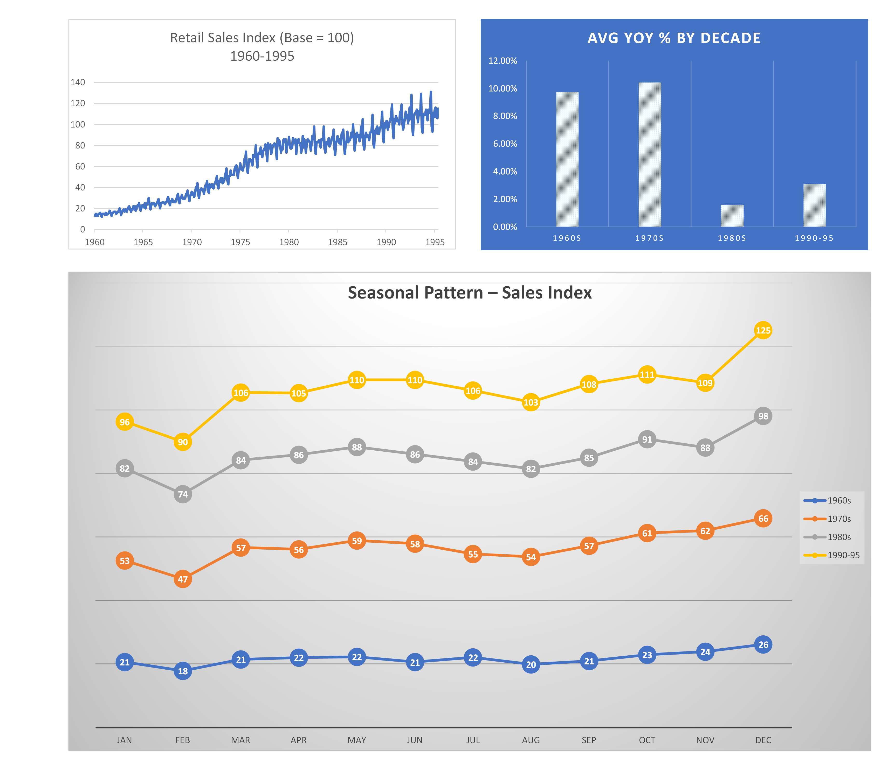

Dutch Retail Sales Dashboard (1960–1995)

Overview
This project showcases a professional Excel dashboard visualizing Dutch retail sales trends from 1960 to 1995. It was designed as a KPI example for data visualization and reporting, suitable for portfolio demonstration on Fiverr and other platforms.

Key Features

* Retail Sales Index Trend (1960–1995): A time-series chart illustrating overall growth and long-term patterns.
* Average YOY % by Decade: A bar chart comparing year-over-year growth across the 1960s, 1970s, 1980s, and 1990–1995.
* Seasonal Pattern – Sales Index: A multi-line chart revealing monthly seasonal variations across decades.

Tools & Methods

* Excel: PivotTables and PivotCharts for structured analysis.
* Visualization Techniques: KPI-focused charts optimized for clarity and presentation.
* Data Structure: Fields include Sales Index, YOY %, Month, Year, and Decade.

Insights

* Highlights overall sales trends across 35 years.
* Identifies decades of peak growth through YOY analysis.
* Reveals recurring seasonal patterns month by month.

Deliverables

* Excel workbook containing the full dashboard.
* High-quality PNG exports of the dashboard visuals.

Preview

Usage
Open the Excel file to explore PivotTables and charts.
Review PNG images for quick insights or web use.
Integrate visuals into reports or presentations as needed.

Author
Darren Littlejohn – Data Analyst & Creative Technologist
